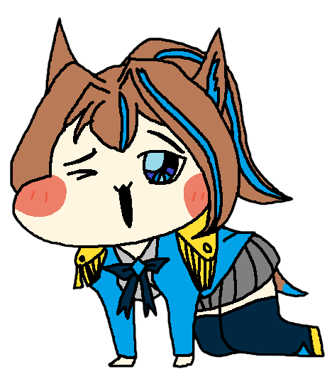

# 데스크탑 히비키 Ver.1

본 프로젝트는 버추얼 스트리머 '코가미 히비키'님에 대한 디지털 팬아트 프로젝트입니다.
개인 취미생활의 영역이며, 포트폴리오나 공식 서류 제출에서는 제외됨을 알립니다.

화면 하단을 돌아다니는 데스크탑 마스코트입니다.  
이미지는 직접 그린 팬아트이며, 코드는 PyQt5 기반으로 작성되었습니다.

---

## 미리보기

| 기본 | 클릭됨 | 기쁨 | 패닉 |
|:---:|:---:|:---:|:---:|
|  |  |  |  |

---

## 설치 및 실행

**요구사항:** Python 3.10 이상, Windows 10/11

```bash
pip install PyQt5
python desktop_walker_V2.py
```

---

## 파일 구성

```
📂 프로젝트 폴더
├── desktop_walker_V2.py              # 메인 실행 파일
├── fake_hibiki_transparent.png       # 기본 이미지
├── fake_hibiki_clicked_transparent.png  # 클릭/드래그 시 이미지
├── fake_hibiki_happy_transparent.png    # 쓰다듬을 때 이미지
└── fake_hibiki_panic_transparent.png    # 패닉 모드 이미지
```

> 모든 파일은 **같은 폴더**에 두어야 합니다.

---

## 조작법

| 조작 | 동작 |
|---|---|
| 좌클릭 | 클릭 반응 (표정 변화 + 납작해지기) |
| 좌클릭 드래그 | 들어올려서 던지기 (물리 적용) |
| 우클릭 | 쓰다듬기 (기쁜 표정) |
| 우클릭 드래그 | 쓰다듬으면서 들어올려 던지기 |

---

## 특수 이벤트

### 😱 패닉 모드 — 좌클릭 7회 연속
5초 안에 7번 클릭하면 발동됩니다.
- 마우스 커서 반대 방향으로 도망
- 벽에 몰리면 커서를 바라보며 부들부들 떨기
- 5초 후 자동 복귀

### 🐾 팔로우 모드 — 우클릭 7회 연속
6초 안에 7번 쓰다듬으면 발동됩니다.
- 마우스 커서를 졸졸 따라다님
- 5초 후 자동 복귀

---

## 평상시 행동

- 화면 하단을 좌우로 걷다가 벽에 닿으면 안쪽으로 걸어나오기
- 가끔 멈춰서 두리번거리기
- 던지면 중력/바운스 물리 적용, 벽과 천장 반발

---

## 커스터마이징

`desktop_walker_V2.py` 상단 설정값을 수정하면 됩니다.

```python
MASCOT_WIDTH    = 200    # 캐릭터 크기 (px)
WALK_SPEED_MIN  = 1.17   # 걷기 최소 속도
WALK_SPEED_MAX  = 2.0    # 걷기 최대 속도
GRAVITY         = 0.77   # 중력 가속도
PANIC_RUN_SPEED = 6.0    # 패닉 모드 도망 속도
```

이미지를 교체하고 싶다면 같은 폴더에 PNG 파일을 넣고 파일명을 맞춰주세요.  
투명 배경(PNG) 이미지를 권장합니다.

---

## 사용 환경

- Windows 10 / 11
- Python 3.10+
- PyQt5

---

*히비키의 팬이 만든 팬 프로젝트입니다.*
